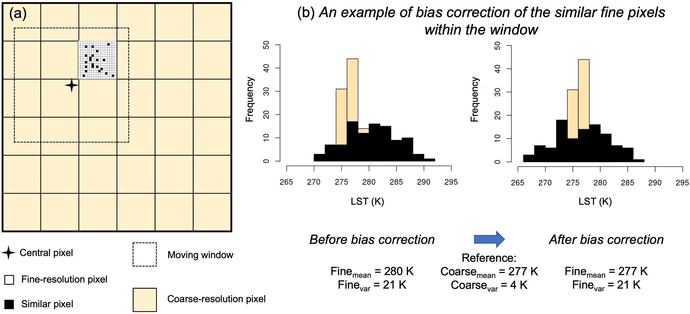
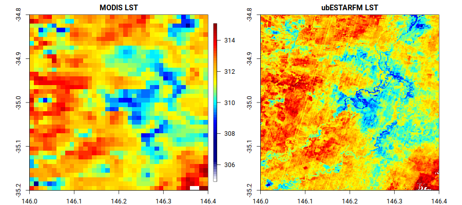
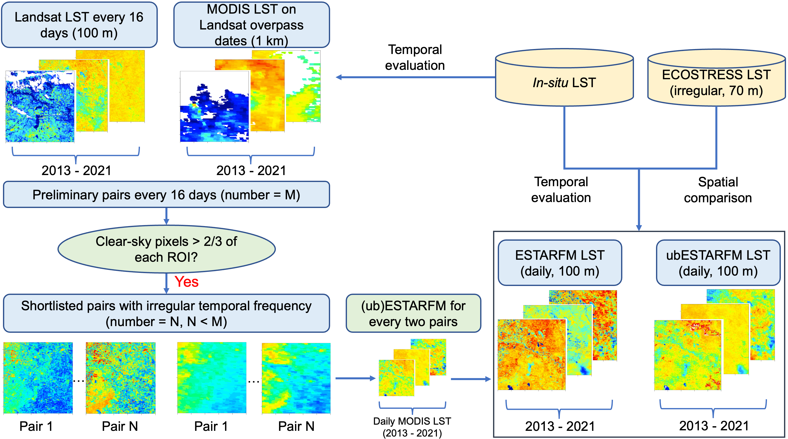

# Unbiased ESTARFM (ubESTARFM) in R

[](https://opensource.org/licenses/MIT)
[](https://www.r-project.org/)
[](https://doi.org/10.5281/zenodo.8017282)
[](https://twitter.com/yy_nash13)

## Contents

- [Overview](#overview)
- [Background](#background)
- [Usage](#usage)
- [LST processing scripts (will be gradually updated)](#lst-processing-scripts)
    - [IMPORTANT NOTE for *in-situ* LST from OzFlux](#important-note-for-in-situ-lst-from-ozflux)
- [Permalink](#permalink)
- [To cite ubESTARFM](#to-cite-ubestarfm)
- [Conference talk](#conference-talk)
- [References](#references)

## Overview

This is the repository for the ubESTARFM algorithm, which was described in detail in [Yu et al. (2023)](https://doi.org/10.1016/j.rse.2023.113784). Apart from the [algorithm](#usage), we also provided the [scripts about how we processed and evaluated the LST data](#lst-processing-scripts) herein.

## Background

Fine spatial resolution land surface temperature (LST) data are crucial to study heterogeneous landscapes (e.g., agricultural and urban). Some well-known spatiotemporal fusion methods like the Spatial and Temporal Adaptive Reflectance Fusion Model (STARFM; Gao et al., 2006) and the Enhanced STARFM (ESTARFM; Zhu et al., 2010), which were originally developed to fuse surface reflectance data, may not be suitable for direct application in LST studies due to the high sub-diurnal dynamics of LST. To address this, we proposed a variant of ESTARFM, referred to as the unbiased ESTARFM (ubESTARFM), specifically designed to accommodate the high temporal dynamics of LST to generate fine-resolution LST estimates. 

In ubESTARFM, we implement a local bias correction on the central pixel and similar fine-resolution pixels within the moving window using the mean value of corresponding coarse-resolution pixels as reference. By applying this linear scaling approach, we can scale the systematic biases of the fine-resolution data to a same level of the corresponding coarse resolution data in each moving window, while maintaining the variation and spatial details of fine resolution data.



## Usage

The ubESTARFM algorithm is written in R. We recommend users to use a multi-core processor that can allow ubESTARFM to run in parallel and to be more efficient.

Please install essential R packages before running ubESTARFM. 

```
install.packages('raster')
install.packages('foreach')
install.packages('doParallel')
```

To see an example of ubESTARFM, **please make sure you are under the directory** `ubESTARFM/`, then simply run the following via the command line:

```
Rscript 0_algorithm/example.R
```

This will run ubESTARFM on a small subset of data (Yanco site) using 4 cores and generate a `fused_result.tif` in the directory `3_output/`.

Have a look at the result:

```
Rscript 0_algorithm/visualise.R
```

This will generate a `visualisation.png` in output that looks like:



Please note the data included in this repository are for demonstration purposes only.

## LST processing scripts

The scripts for processing, fusing and evaluating satellite LST are archived in `4_lst_processing_scripts/` for **reference purposes only**. The scripts are ordered in sequence 00-10, which follows the experimental design as below. However, it is unlikely you can run the scripts directly as the input data are massive and not available here.



### IMPORTANT NOTE for *in-situ* LST from OzFlux

We have found an alternative strategy in processing *in-situ* LST, which does not consider the daylight saving time and expilctly claims the 'seconds' timestep in the TOI (time of interests). Compared to the strategy used in our RSE paper (i.e., `4_lst_processing_scripts/00_process_ozflux_rse_version.R`), this strategy is expected to better coincides with the satellite overpass time. Please refer to the script `4_lst_processing_scripts/00_process_ozflux_updated.R` for more details.

All the updated OzFlux LST data are available at `5_ozflux_lst/`.

## Permalink

If you are interested in having a comprehensive assessment of ubESTARFM, please refer to the dataset published in the [CSIRO Data Access Portal](https://doi.org/10.25919/b77m-8n31), which contains the full set of data (12 OzFlux sites across Australia for the period of 2013-2021) used in our RSE paper.

The published link of this code is at [Zenodo](https://doi.org/10.5281/zenodo.8017282). You can also find an archived version at [ResearchGate](https://www.researchgate.net/publication/371376456_Unbiased_ESTARFM_ubESTARFM).

## To cite ubESTARFM

If you found this repository helpful, please kindly consider citing:

- Yu, Y., Renzullo, L. J., McVicar, T. R., Malone, B. P. and Tian, S., 2023. Generating daily 100 m resolution land surface temperature estimates continentally using an unbiased spatiotemporal fusion approach. *Remote Sensing of Environment, 297*, 113784. https://doi.org/10.1016/j.rse.2023.113784

## Conference talk

- Yu, Y., Renzullo, L. J., Tian, S. and Malone, B. P., 2023. An unbiased spatiotemporal fusion approach to generate daily 100 m spatial resolution land surface temperature over a continental scale, *EGU General Assembly 2023, Vienna, Austria, 24-28 April*, EGU23-1501. https://doi.org/10.5194/egusphere-egu23-1501

## References

- Gao, F., Masek, J., Schwaller, M. and Hall, F., 2006. On the blending of the Landsat and MODIS surface reflectance: Predicting daily Landsat surface reflectance. *IEEE Transactions on Geoscience and Remote Sensing, 44*, 2207-2218. https://doi.org/10.1109/TGRS.2006.872081

- Zhu, X., Chen, J., Gao, F., Chen, X. and Masek, J. G., 2010. An enhanced spatial and temporal adaptive reflectance fusion model for complex heterogeneous regions. *Remote Sensing of Environment, 114*, 2610-2623. https://doi.org/10.1016/j.rse.2010.05.032
