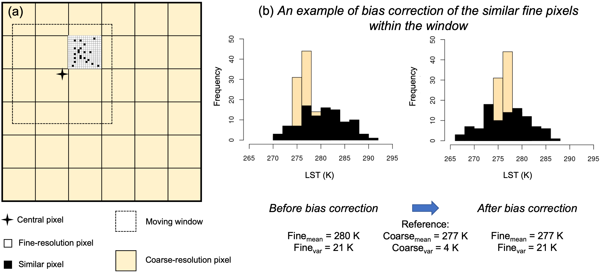
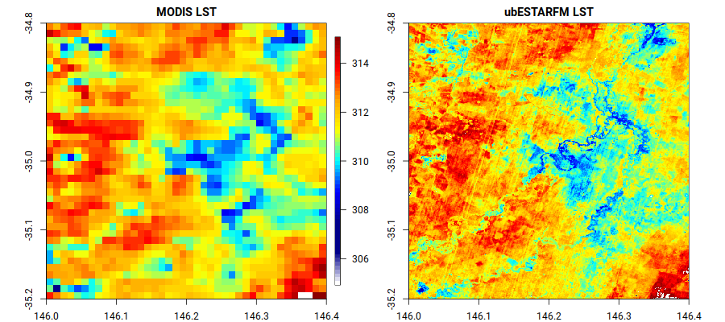
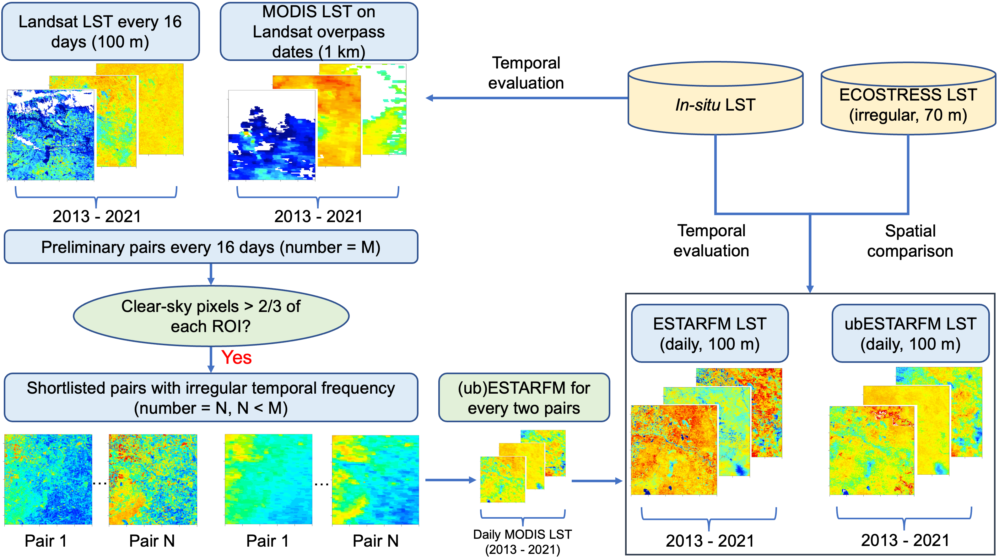

# Unbiased ESTARFM (ubESTARFM) in R and Python

[](LICENSE.md)
[](https://www.r-project.org/)
[](https://www.python.org/)
[](https://doi.org/10.5281/zenodo.8017282)
[](https://doi.org/10.1016/j.rse.2023.113784)
[](https://doi.org/10.25919/rrpg-m948)

## Contents

- [Unbiased ESTARFM (ubESTARFM) in R and Python](#unbiased-estarfm-ubestarfm-in-r-and-python)
  - [Contents](#contents)
  - [Overview](#overview)
  - [Background](#background)
  - [Repository structure](#repository-structure)
  - [Installation](#installation)
  - [Demo and usage](#demo-and-usage)
    - [Train once](#train-once)
    - [Predict one target](#predict-one-target)
    - [Predict a batch](#predict-a-batch)
    - [Run the maintained examples](#run-the-maintained-examples)
    - [Demonstration result](#demonstration-result)
  - [Model caching and performance](#model-caching-and-performance)
  - [Published R compatibility](#published-r-compatibility)
  - [LST processing scripts](#lst-processing-scripts)
    - [Important note for in-situ LST from OzFlux](#important-note-for-in-situ-lst-from-ozflux)
  - [Data and permalinks](#data-and-permalinks)
  - [Documentation](#documentation)
  - [Citation](#citation)
  - [Conference talk](#conference-talk)
  - [References](#references)

## Overview

This repository contains the unbiased Enhanced Spatial and Temporal Adaptive
Reflectance Fusion Model (ubESTARFM), described in
[Yu et al. (2023)](https://doi.org/10.1016/j.rse.2023.113784). It also retains
the scripts used to process and evaluate the land surface temperature (LST)
data in that study.

The maintained implementation is available in R and Python. It separates the
algorithm into two stages: train the relationships from two fine/coarse
reference pairs once, then reuse that model to predict one or many intervening
target dates. The published R implementation remains preserved byte-for-byte
in [`legacy/ubESTARFM.R`](legacy/ubESTARFM.R).

## Background

Fine-spatial-resolution LST data are crucial for studying heterogeneous
landscapes such as agricultural and urban areas. Well-known spatiotemporal
fusion methods including the Spatial and Temporal Adaptive Reflectance Fusion
Model (STARFM; Gao et al., 2006) and Enhanced STARFM (ESTARFM; Zhu et al.,
2010) were originally developed to fuse surface reflectance. Direct
application to LST can be unsuitable because LST has strong sub-daily
dynamics.

ubESTARFM is an ESTARFM variant designed for those temporal dynamics. It
applies local bias correction to the central pixel and similar
fine-resolution pixels within each moving window, using the mean of the
corresponding coarse-resolution pixels as the reference. This linear scaling
places systematic fine-resolution bias on the same level as the corresponding
coarse-resolution data while retaining fine-resolution variation and spatial
detail.



## Repository structure

The repository now uses descriptive paths rather than the numbered directories
in the published release:

| Purpose | Current path |
|---|---|
| Maintained R package | [`R/`](R/) and [`src/`](src/) |
| Maintained Python package | [`python/`](python/) |
| Bundled demonstration rasters | [`inst/extdata/`](inst/extdata/) |
| Maintained examples | [`examples/R/`](examples/R/) and [`examples/python/`](examples/python/) |
| Published R algorithm | [`legacy/ubESTARFM.R`](legacy/ubESTARFM.R) |
| Published example and visualization scripts | [`legacy/examples/`](legacy/examples/) |
| Archived paper-processing scripts | [`legacy/paper-processing/`](legacy/paper-processing/) |
| Updated OzFlux LST data | [`data/ozflux/`](data/ozflux/) |
| Tutorials and migration notes | [`docs/`](docs/) |
| Cross-language and regression tests | [`tests/`](tests/) |

See the [repository-layout migration guide](docs/migration/repository-layout.md)
for the complete old-to-new path mapping.

## Installation

Install the R package from the repository root:

```bash
Rscript -e 'install.packages(c("terra", "Rcpp"))'
R CMD INSTALL .
```

Install the Python package from the repository root:

```bash
python3 -m pip install ./python
```

Python 3.12 or later is required. If using `uv`, the equivalent command is
`uv pip install ./python`.

## Demo and usage

The bundled rasters in [`inst/extdata/`](inst/extdata/) are small subsets from
the Yanco site and are provided for demonstration only. The two reference
dates are 5 February 2016 and 8 March 2016; the bundled target date is
18 February 2016.

### Train once

R:

```r
library(ubESTARFM)

model <- ubestarfm_train(
  fine_1 = "inst/extdata/Landsat_LST_cloudrm_20160205.tif",
  fine_2 = "inst/extdata/Landsat_LST_cloudrm_20160308.tif",
  coarse_1 = "inst/extdata/MOD11A1_LST_cloudrm_20160205.tif",
  coarse_2 = "inst/extdata/MOD11A1_LST_cloudrm_20160308.tif",
  window_radius = 25L,
  patch_size = 200L,
  workers = 4L
)
```

Python:

```python
from ubestarfm import train

model = train(
    "inst/extdata/Landsat_LST_cloudrm_20160205.tif",
    "inst/extdata/Landsat_LST_cloudrm_20160308.tif",
    "inst/extdata/MOD11A1_LST_cloudrm_20160205.tif",
    "inst/extdata/MOD11A1_LST_cloudrm_20160308.tif",
    window_radius=25,
    patch_size=200,
    workers=4,
)
```

Training identifies and stores the candidate relationships determined only by
the two reference pairs. These relationships do not change between target
dates.

### Predict one target

R:

```r
prediction <- ubestarfm_predict(
  model,
  "inst/extdata/MOD11A1_LST_cloudrm_20160218.tif",
  output_path = "examples/outputs/r_single_20160218.tif",
  overwrite = TRUE,
  workers = 4L
)
```

Python:

```python
from ubestarfm import predict

prediction = predict(
    model,
    "inst/extdata/MOD11A1_LST_cloudrm_20160218.tif",
    output_path="examples/outputs/python_single_20160218.tif",
    overwrite=True,
    workers=4,
)
```

### Predict a batch

Use one batch call when several target dates share the same reference pair.
The repository contains only one target date, so these runnable snippets repeat
that target under two output names to demonstrate model reuse.

R:

```r
targets <- rep(
  "inst/extdata/MOD11A1_LST_cloudrm_20160218.tif",
  2L
)
predictions <- ubestarfm_predict_batch(
  model,
  targets,
  output_paths = file.path(
    "examples",
    "outputs",
    c("r_batch_20160218_a.tif", "r_batch_20160218_b.tif")
  ),
  overwrite = TRUE,
  workers = 4L
)
```

Python:

```python
from ubestarfm import predict_batch

target = "inst/extdata/MOD11A1_LST_cloudrm_20160218.tif"
predictions = predict_batch(
    model,
    [target, target],
    output_paths=[
        "examples/outputs/python_batch_20160218_a.tif",
        "examples/outputs/python_batch_20160218_b.tif",
    ],
    overwrite=True,
    workers=4,
)
```

### Run the maintained examples

After installing both packages, run the complete examples from the repository
root:

```bash
Rscript examples/R/single_target.R --output-dir examples/outputs
Rscript examples/R/batch_targets.R --output-dir examples/outputs
python3 examples/python/single_target.py --output-dir examples/outputs
python3 examples/python/batch_targets.py --output-dir examples/outputs
```

The historical scripts are retained in
[`legacy/examples/`](legacy/examples/) for provenance; use the maintained
examples above for current workflows.

### Demonstration result

The visualization generated for the published example is retained here:



## Model caching and performance

Save a trained model when later target rasters will use the same reference
pair:

```r
ubestarfm_save_model(model, "reference_pair.rds")
model <- ubestarfm_load_model("reference_pair.rds")
```

```python
from ubestarfm import load_model, save_model

save_model(model, "reference_pair.npz")
model = load_model("reference_pair.npz")
```

The reusable model stores packed candidate-membership bitsets rather than a
large nested coefficient object. For the bundled 400 by 400 rasters and a
51 by 51 window, the in-memory model is approximately 56 MiB in both
implementations. Prediction-specific weights are reconstructed so that missing
values on each target date are handled correctly.

Runtime depends on hardware and worker count. Reproduce the maintained
measurements with [`benchmarks/benchmark.R`](benchmarks/benchmark.R) and
[`benchmarks/benchmark.py`](benchmarks/benchmark.py). See the
[model-caching tutorial](docs/tutorials/model-caching.md) for the storage
design and tradeoffs.

## Published R compatibility

The published `ubESTARFM()` function remains available and delegates to the
maintained train/predict engine. Existing R code can therefore migrate
incrementally, while new code should use `ubestarfm_train()`,
`ubestarfm_predict()`, and `ubestarfm_predict_batch()`.

The original published implementation is preserved unchanged at
[`legacy/ubESTARFM.R`](legacy/ubESTARFM.R). See the
[published R API migration guide](docs/migration/from-published-r-api.md) for
method-name, temporary-directory, and missing-value details.

## LST processing scripts

The scripts used to process, fuse, and evaluate satellite LST for the
publication are archived in
[`legacy/paper-processing/`](legacy/paper-processing/) for reference. Their
00-10 numbering follows the experimental sequence below.



The archived scripts depend on the full study inputs, which are large and are
not included in this repository. They are retained to document the published
workflow and are not expected to run directly against the bundled
demonstration rasters.

### Important note for in-situ LST from OzFlux

An updated OzFlux processing strategy is provided in
[`legacy/paper-processing/00_process_ozflux_updated.R`](legacy/paper-processing/00_process_ozflux_updated.R).
Unlike the RSE-paper version in
[`legacy/paper-processing/00_process_ozflux_rse_version.R`](legacy/paper-processing/00_process_ozflux_rse_version.R),
the updated strategy does not adjust for daylight saving time and explicitly
uses seconds for the time-of-interest step. It is expected to align more
closely with satellite overpass time.

The resulting updated OzFlux LST data are available in
[`data/ozflux/`](data/ozflux/).

## Data and permalinks

The rasters bundled in this repository are demonstration subsets. The complete
assessment dataset contains 12 Australian OzFlux sites covering 2013-2021 and
is available through the
[CSIRO Data Access Portal](https://doi.org/10.25919/rrpg-m948).

The published code release is archived on
[Zenodo](https://doi.org/10.5281/zenodo.8017282). A lite version is also
available on
[ResearchGate](https://www.researchgate.net/publication/371376456_Unbiased_ESTARFM_ubESTARFM).

## Documentation

- [R single-target and batch tutorial](docs/tutorials/r-single-and-batch.md)
- [Python single-target and batch tutorial](docs/tutorials/python-single-and-batch.md)
- [Model caching and memory](docs/tutorials/model-caching.md)
- [Migration from the published R API](docs/migration/from-published-r-api.md)
- [Repository layout migration](docs/migration/repository-layout.md)
- [Benchmarks](benchmarks/)
- [Contributing guide](CONTRIBUTING.md)

## Citation

If this repository or algorithm supports your work, please cite:

```bibtex
@article{yu_generating_2023,
  author  = {Yi Yu and Luigi J. Renzullo and Tim R. McVicar and Brendan P. Malone and Siyuan Tian},
  title   = {Generating daily 100 m resolution land surface temperature estimates continentally using an unbiased spatiotemporal fusion approach},
  journal = {Remote Sensing of Environment},
  volume  = {297},
  pages   = {113784},
  year    = {2023},
  doi     = {10.1016/j.rse.2023.113784}
}
```

## Conference talk

- Yu, Y., Renzullo, L. J., Tian, S., and Malone, B. P. (2023). An unbiased
  spatiotemporal fusion approach to generate daily 100 m spatial resolution
  land surface temperature over a continental scale. *EGU General Assembly
  2023, Vienna, Austria, 24-28 April*, EGU23-1501.
  https://doi.org/10.5194/egusphere-egu23-1501

## References

- Gao, F., Masek, J., Schwaller, M., and Hall, F. (2006). On the blending of
  the Landsat and MODIS surface reflectance: Predicting daily Landsat surface
  reflectance. *IEEE Transactions on Geoscience and Remote Sensing*, 44,
  2207-2218. https://doi.org/10.1109/TGRS.2006.872081

- Zhu, X., Chen, J., Gao, F., Chen, X., and Masek, J. G. (2010). An enhanced
  spatial and temporal adaptive reflectance fusion model for complex
  heterogeneous regions. *Remote Sensing of Environment*, 114, 2610-2623.
  https://doi.org/10.1016/j.rse.2010.05.032
